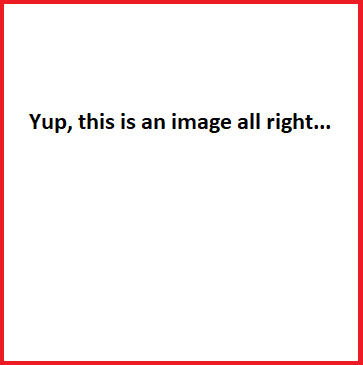

= AsciiDoc Article Title
Firstname Lastname <author@asciidoctor.org>
3.0, July 29, 2022: AsciiDoc article template
:toc:
:icons: font
:url-quickref: https://docs.asciidoctor.org/asciidoc/latest/syntax-quick-reference/

Content entered directly below the header but before the first section heading is called the preamble.

== First level heading

This is a paragraph with a *bold* word and an _italicized_ word.

.Image caption

This is another paragraph.footnote:[I am footnote text and will be displayed at the bottom of the article.]

=== Second level heading

.Unordered list title
* list item 1
** nested list item
*** nested nested list item 1
*** nested nested list item 2
* list item 2

This is a paragraph.

.Example block title
====
Content in an example block is subject to normal substitutions.
====

.Sidebar title
****
Sidebars contain aside text and are subject to normal substitutions.
****

[#third_level_heading_id]
==== Third level heading

[#id-for-listing-block]
.Listing block title
----
Content in a listing block is subject to verbatim substitutions.
Listing block content is commonly used to preserve code input.
----

===== Fourth level heading

.Table title
|===
|Column heading 1 |Column heading 2

|Column 1, row 1
|Column 2, row 1

|Column 1, row 2
|Column 2, row 2
|===

====== Fifth level heading

[quote,firstname lastname,movie title]
____
I am a block quote or a prose excerpt.
I am subject to normal substitutions.
____

[verse,firstname lastname,poem title and more]
____
I am a verse block.
  Indents and endlines are preserved in verse blocks.
____

== First level heading

TIP: There are five admonition labels: Tip, Note, Important, Caution and Warning.

// I am a comment and won't be rendered.

. ordered list item
.. nested ordered list item
. ordered list item

The text at the end of this sentence is cross referenced to <<third_level_heading_id,the third level heading>>

== First level heading

This is a link to the https://docs.asciidoctor.org/home/[Asciidoctor documentation].
This is an attribute reference {url-quickref}[that links this text to the AsciiDoc Syntax Quick Reference].

== My own tests

////
Comment block
multiple lines
hurrah!
////

// ditaa diagram
[ditaa]
----
              +-------------+
              | asciidoctor |-----------+
              |  diagram    |           |
              +-------------+           | image
                    ^                   |
                    | diagram source    |
                    |                   v
 +--------+   +-----+-------+    /---------------\
 |  adoc  |-->+ asciidoctor +    | HTML + image  |
 +--------+   +-------------+    \---------------/
----

[ditaa]
....
      /---------------------\   /--------------------\
      |                     |   |                    |
      |    /-------------\  |   |  /--------------\  |
      |    |  Serialize  |  |   |  |  Serializer  |  |
      |    \-------------/  |   |  \--------------/  |
      |       ^       |     |   |    ^       |       |
      |       |       v     |   |    |       v       |
+-----+----------+  /-------+---+------\  +----------+---+
| data structure |  | serde data model |  | data format  |
+-----+----------+  \-------+---+------/  +----------+---+
      |       ^       |     |   |    ^       |       |
      |       |       v     |   |    |       v       |
      |    /-------------\  |   |  /--------------\  |
      |    | Deserialize |  |   |  | Deserializer |  |
      |    \-------------/  |   |  \--------------/  |
      | cGRE                |   | c1AB               |
      \---------------------/   \--------------------/
                 ser                      de
....

// PlantUML
[plantuml.freesize,mindmap]
----
@startmindmap
+ Programming
++ Languages
+++_ Crafting Interpreters
+++_ compilerbook
++ Games
+++_ Languages
+++_ Frameworks
-- Text editors
---_ VSCode
---_ Sublime Text 3
---_ NeoVim
---_ Evil Emacs
@endmindmap
----

////
Needs mermaid executable on the path, did not try to make it work
[mermaid]
----
graph TD
    A[Christmas] -->|Get money| B(Go shopping)
    B --> C{Let me think}
    C -->|One| D[Laptop]
    C -->|Two| E[iPhone]
    C -->|Three| F[Car]
----
////

// checking the Hunspell plugin with downloaded Hungarian dictionary
Magyar nyelv helyes írás Ööööö Hüllő

// Three arrows to the left means line break in PDF
<<<

// include another file, like a license or something that is common to your documents
include::inc/license.adoc[]